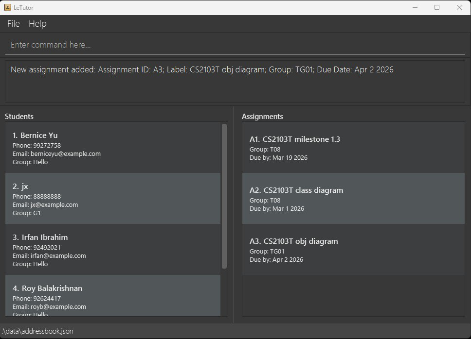
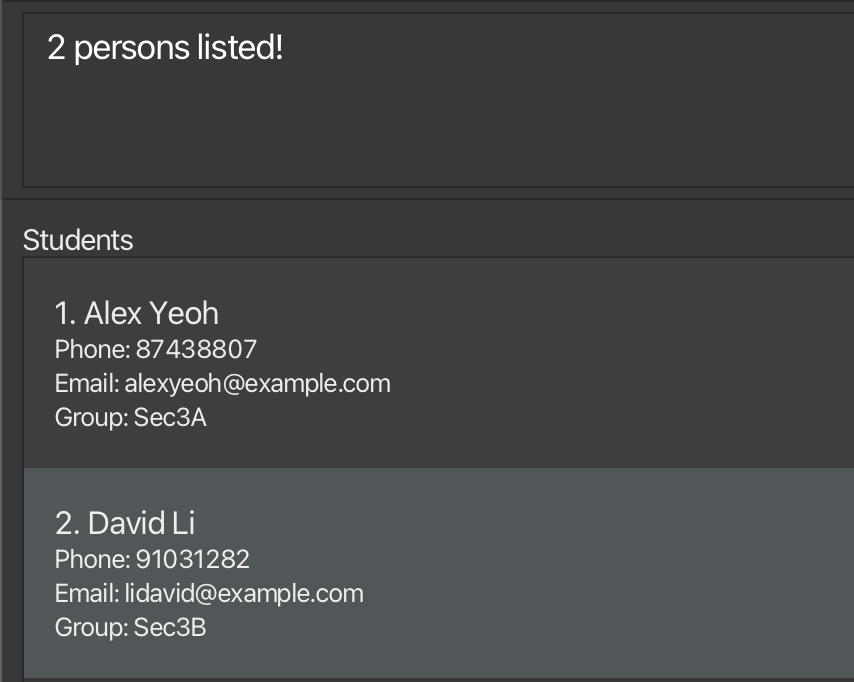

# LeTutor User Guide

LeTutor is a **desktop app for managing students and assignments, optimized for use via a  Line Interface** (CLI) while still having the benefits of a Graphical User Interface (GUI). If you can type fast, AB3 can get your student and assignment management tasks done faster than traditional GUI apps.

<!-- * Table of Contents -->
<page-nav-print />

--------------------------------------------------------------------------------------------------------------------

## Quick start

1. Ensure you have Java `17` or above installed in your Computer. 
   **Mac users:** Ensure you have the precise JDK version prescribed [here](https://se-education.org/guides/tutorials/javaInstallationMac.html).

1. Download the latest `.jar` file from [here](https://github.com/AY2526S2-CS2103T-T08-4/tp/releases/tag/v1.3).

1. Copy the file to the folder you want to use as the _home folder_ for your AddressBook.

1. Open a command terminal, `cd` into the folder you put the jar file in, and use the `java -jar letutor.jar` command to run the application. 
   A GUI similar to the below should appear in a few seconds. 
   

1. Type the command in the command box and press Enter to execute it. e.g. typing **`help`** and pressing Enter will open the help window. 
   Some example commands you can try:

   * `list` : Lists all students

   * `add /students {John Doe; 98765432; johnd@example.com; Sec3A}`: Adds a student named `John Doe` to the Address Book.

   * `delete /students 3` : Deletes the 3rd students shown in the current list.

   * `clear` : Deletes all students and assignments.

   * `exit` : Exits the app.

1. Refer to the [Features](#features) below for details of each command.

--------------------------------------------------------------------------------------------------------------------

## Features

<box type="info" seamless>

**Notes about the command format:** 

* Words in `UPPER_CASE` are the parameters to be supplied by the user. 
  e.g. in `add n/NAME`, `NAME` is a parameter which can be used as `add n/John Doe`.

* Items in square brackets are optional. 
  e.g `n/NAME [t/TAG]` can be used as `n/John Doe t/friend` or as `n/John Doe`.

* Items with `…`​ after them can be used multiple times including zero times. 
  e.g. `[t/TAG]…​` can be used as ` ` (i.e. 0 times), `t/friend`, `t/friend t/family` etc.

* Parameters can be in any order. 
  e.g. if the command specifies `n/NAME p/PHONE_NUMBER`, `p/PHONE_NUMBER n/NAME` is also acceptable.

* Extraneous parameters for commands that do not take in parameters (such as `help`, `list`, `exit` and `clear`) will be ignored. 
  e.g. if the command specifies `help 123`, it will be interpreted as `help`.

* If you are using a PDF version of this document, be careful when copying and pasting commands that span multiple lines as space characters surrounding line-breaks may be omitted when copied over to the application.

</box>

### Viewing help : `help`

Shows a message explaining how to access the help page.

Format: `help`

### Adding a student: `add /students`

Adds a student to the address book.

Format: `add /students {<name>; <phone>; <email>; <group>}`

Example: `add /students {John Doe; 98765432; johnd@example.com; Sec3A}`

### Adding an assignment: `add /assignments`

Adds an assignment to the address book.

Format: `add /assignments {<label>; <group>; <dueDate>}`

* The `dueDate` should be in the format `YYYY-MM-DD`. e.g. `2026-03-20` for 20 March 2026.

Example: `add /assignments {Math; Sec3A; 2026-03-20}`

### Listing all students : `list`

Shows a list of all students in the address book.

Format: `list`

### Listing all assignments: `get /assignments`

Shows a list of all assignments in the address book.

Format: `get /assignments`

### Viewing details of a student: `get /students`

Shows the details of a student in the address book.

Format: `get /students <studentId>`

* Shows the details of the student with the specified `studentId`.
* The `studentId` is the unique identifier of a student, which is automatically generated when a student is added to the address book. It is a **positive integer** that increments by 1 for each new student added. The first student added will have a `studentId` of 1, the second student will have a `studentId` of 2, and so on.

Example: `get /students 3`

### View details of an assignment: `get /assignments`

Shows the details of an assignment in the address book.

Format: `get /assignments <assignmentId>`

* Shows the details of the assignment with the specified `assignmentId`.
* The `assignmentId` is the unique identifier of an assignment, which is automatically generated when an assignment is added to the address book. It is a **positive integer** that increments by 1 for each new assignment added. The first assignment added will have an `assignmentId` of 1, the second assignment will have an `assignmentId` of 2, and so on.

Example: `get /assignments 2`

### Locating students by name: `find /students`

Finds students whose names contain any of the given keywords.

Format: `find /students <keywords>`

* The search is case-insensitive. e.g `hans` will match `Hans`
* The order of the keywords does not matter. e.g. `Hans Bo` will match `Bo Hans`
* Only the name is searched.
* Only full words will be matched e.g. `Han` will not match `Hans`
* Persons matching at least one keyword will be returned (i.e. `OR` search).
  e.g. `Hans Bo` will return `Hans Gruber`, `Bo Yang`

Examples:
* `find /students John` returns `john` and `John Doe`
* `find /students alex david` returns `Alex Yeoh`, `David Li` 
  

### Editing a student: `edit /students`

Edits the details of a student in the address book.

Format: `edit /students <studentId> {<name>; <phone>; <email>; <group>}`

* Edits the person at the specified `studentId`
* All fields must be provided when editing a student, and the fields will be updated to the input values. For example, if you only want to update the phone number of a student, you will need to provide the existing values for the other fields (name, email and group) as well.

Example: `edit /students 1 {John Doe; 98765432; johnd@mail.com; Sec3B}`

### Deleting a student : `delete /students`

Deletes the specified student from the address book.

Format: `delete /students <studentId>`

* Deletes the student at the specified `studentId`.

Example: `delete /students 3`

### Deleting an assignment : `delete /assignments`

Deletes the specified assignment from the address book.

Format: `delete /assignments <assignmentId>`

* Deletes the assignment at the specified `assignmentId`.

Example: `delete /assignments 2`

### Clearing all entries : `clear`

Clears all student and assignment entries from the address book.

Format: `clear`

### Exiting the program : `exit`

Exits the program.

Format: `exit`

### Saving the data

AddressBook data are saved in the hard disk automatically after any command that changes the data. There is no need to save manually.

### Editing the data file

AddressBook data are saved automatically as a JSON file `[JAR file location]/data/addressbook.json`. Advanced users are welcome to update data directly by editing that data file.

<box type="warning" seamless>

**Caution:**
If your changes to the data file makes its format invalid, AddressBook will discard all data and start with an empty data file at the next run.  Hence, it is recommended to take a backup of the file before editing it. 
Furthermore, certain edits can cause the AddressBook to behave in unexpected ways (e.g., if a value entered is outside the acceptable range). Therefore, edit the data file only if you are confident that you can update it correctly.

</box>

--------------------------------------------------------------------------------------------------------------------

## FAQ

**Q**: How do I transfer my data to another Computer? 
**A**: Install the app in the other computer and overwrite the empty data file it creates with the file that contains the data of your previous AddressBook home folder.

--------------------------------------------------------------------------------------------------------------------

## Known issues

1. **When using multiple screens**, if you move the application to a secondary screen, and later switch to using only the primary screen, the GUI will open off-screen. The remedy is to delete the `preferences.json` file created by the application before running the application again.
2. **If you minimize the Help Window** and then run the `help` command (or use the `Help` menu, or the keyboard shortcut `F1`) again, the original Help Window will remain minimized, and no new Help Window will appear. The remedy is to manually restore the minimized Help Window.

--------------------------------------------------------------------------------------------------------------------

## Command summary

Action     | Format, Examples                                                                                                              
-----------|-------------------------------------------------------------------------------------------------------------------------------
**Add Student**  | `add /students {<name>; <phone>; <email>; <group>}`   e.g., `add /students {John Doe; 98765432; johnd@example.com; Sec3A}`
**Add Assignment**  | `add /assignments {<label>; <group>; <dueDate>}`   e.g., `add /assignments {Math; Sec3A; 2026-03-20}`
**List All Students**   | `list`
**List All Assignments**   | `get /assignments`
**Get Student**  | `get /students <studentId>`   e.g., `get /students 3`
**Get Assignment**  | `get /assignments <assignmentId>`   e.g., `get /assignments 2`
**Find Student**  | `find /students <keywords>`   e.g., `find /students alex david`
**Edit Student**  | `edit /students <studentId> {<name>; <phone>; <email>; <group>}`   e.g., `edit /students 1 {John Doe; 98765432; johnd@mail.com; Sec3B}`
**Delete Student**  | `delete /students <studentId>`   e.g., `delete /students 3`
**Delete Assignment** | `delete /assignments <assignmentId>`   e.g `delete /assignments 2`
**Clear**  | `clear`
**Help**   | `help`
